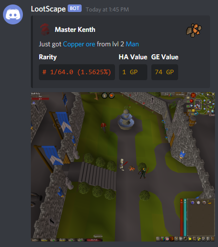

# Bingo Party
__Plugin for RuneLite__ 

## Description
This is a plugin for automatically posting a Discord channel message and screenshot whenever the user an item associated to a pre-determined list.

Traditionally used for clan bingos, hence the name of the plug :)

#### Example upload

## Features
* Show account type icon (Ironman variants)
* Show item icon
* Post screenshot
* OSRS wiki links for item and npc killed
* Pet drop notification (rudimentary)

## Configuration

[//]: # (![config]&#40;readme-resources/config.png&#41;)

### Webhook options

**Discord webhook URL(s):** These are the webhook URLs for Discord or other services. 
Follow [these instructions](https://support.discord.com/hc/en-us/articles/228383668-Intro-to-Webhooks) to setup in discord.
*Separated by a newline.*

**Send embedded message:** Enable to send the embed message instead of a text message. 

**Send screenshot:** Enable to automatically send a screenshot as a separate message on item drop.

### Item lists

**Bingo Items:** When exactly matched this will always send the notification, no matter of other settings. When partially matched and **no** exact ignored items are matched, this will also be sent.

### Item filters
**TBD**

## Thanks to

**Original author:** @MasterKenth

**Current repository owner:** @Dragz 

**and other contributors!** 